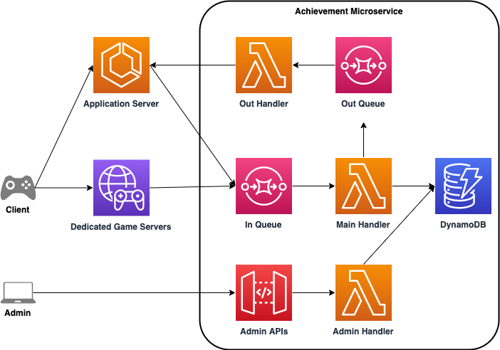

# Achievement Microservices Sample

This CDK project is a sample solution for achievement microservices in games.\
The sample solution contains AWS Lambda Functions, Amazon DynamoDB Tables, Amazon SQS Queues and Amazon API Gateway.

## Key features

- the solution is constructed with only serverless services
- the solution handles achievement progress additions asynchronously
- a single progress can trigger multiple achievements
  - for example, progress with winning matches could trigger achievements for 10 wins, 50 wins and 100 wins.
- achievement requirements can be appended, and new achievements will be unlocked on the next progress event, as long as the new requirements are after the previous requirements,
  - for example, if there are 10 wins and 50 wins achievements, then you can add 100 wins but not 30 wins.
- the solution has an SQS queue in front, so multiple backend services can send progress events
- the solution has an SQS queue for outputting achieved events, you can add handlers to send achieved events back to clients
  - for example, have an API server with websocket connection and poll events from the queue
- the solution is decoupled from game specific details (achievement descriptions, images, titles, and more), the solution simply handles progresses and achievements with IDs
- the solution handles duplicated messages gracefully using DynamoDB conditional Put

## Assumptions

- another service, such as an application server, has bidirectional connection with clients
- achievement metadata is stored separately with all IDs matched

## Architecture

As Shown in the diagram below, there are three Lambda functions, two SQS queues in front of DynamoDB.\
`In Queue` handles all input messages from game backend services, and `Out Handler` can be replaced or used to talk back to game clients.\
There also is an API Gateway for admin purposes, however another API Gateway may be required for requesting current player achievements.\


## DynamoDB Tables

### Player Table: (1 table, 2 entry types)

#### Player Achievement Entries

Each entry represents an achieved achievement by a player with player ID

| PK: playerId      | SK: id                | achievedAt |
|-------------------|-----------------------|------------|
| string: player ID | string achievement ID | timestamp  |

#### Player Progress Entries

Each entry represents current progress for specific progress with progress ID by a player with player ID

| PK: playerId      | SK: id              | progress                 | lastUpdated |
|-------------------|---------------------|--------------------------|-------------|
| string: player ID | string: progress ID | number: current progress | timestamp   |

### Admin Data Table (1 table, 1 entry type)

#### Achievement Data Entries

Each entry represents an achievement and its requirement, a requirement has progress ID and required amount of progress


| PK: achievementId      | GSI PK: requiredProgress | GSI SK: requiredAmount  |
|------------------------|--------------------------|-------------------------|
| string: achievement ID | string: progress ID      | number: required amount |

### Progress Message Table (1 table, 1 entry type)

#### Progress Message Entries

Each entry represents a message from In Queue, a message only stays in this table for 5 minutes, this is used for duplication check

| PK: messageId          | TTL: ttl              |
|------------------------|-----------------------|
| string: sqs message ID | number: ttl timestamp |

## SQS Message Syntax

### In Message

```
{
    “playerId”: string,
    “progressId”: string,
    “progressIncrement”: number,
}
```

### Out Message

```
{
    “playerId”: string,
    “achievementId”: string,
}
```

### Prerequisites

- An AWS account
- Nodejs LTS installed, such as 14.x
- Install Docker Engine

## Usage

### Deployment

To deploy the example stack to your default AWS account/region, under project root folder, run:

1. `yarn install` to install all the dependencies
2. `cdk deploy` to deploy this stack to your default AWS account/region

### Setup Achievement Data
Once the deployment is completed, you should be able to locate API Gateway url in `Outputs` tab. Use the url and send `POST` request to insert achievement data. Sample request body is:\

```
{
    "achievementId": "a1",
    "requiredProgress": "p1",
    "requiredAmount": 3,
}
```

With `curl`:\

```
$ curl -XPOST https://<YOUR ENDPOINT>/prod/achievements \
  -H "Content-Type: application/json" \
  -d '{"achievementId": "a1", "requiredProgress": "p1", "requiredAmount": 3}'
```

### Send Progress Events

To test your service, you can start sending messages to `In Queue`. You can use test message located in `test/testMessage.json`.

To send messages, you can either:

- use AWS Console, go to Amazon SQS, find a queue with `InQueue` in its name, then go to `Send and receive messages`
- use AWS CLI, for example
  - `aws sqs send-message --queue-url <YOUR QUEUE URL> --message-body file://test/testMessage.json`

## License

This solution is licensed under the MIT-0 License. See the LICENSE file.

Also, this application uses below open source project,

- [aigle](https://www.npmjs.com/package/aigle)
